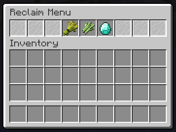

# UnitedReclaim
Configure your reclaims in a customizable GUI.



## Features
* Customizable GUI
* Lightweight

## Getting Started
1. Check our releases for latest version.
2. Place file in your server plugins folder.
3. Start your server to generate the default config.yml file
4. Modify the config.yml to your likings
5. Restart your server to apply.

### Dependencies
* Spigot/Paper/etc API or similar
* That't it!

## Config
```yml
message-prefix: '[UnitedReclaims] '
deny-permission-message: "Sorry, you don't have permission to do that."
gui: #Permission to access gui is unitedreclaim.gui.access
  title: 'Reclaim Menu' #Name of /reclaim gui
  rows: 1 #Size of gui must be at least more than amount of reclaims
reclaim-item-key: '3nyS_"7^&TeSCRj=PK7@HfA.^'

reclaims:
  placeholder0: # This is an item that will show in the gui that does nothing, example you can set a boarder around the gui with these
    # Permission section not required
    gui-item:
      item: 'STAINED_GLASS_PANE'
      display-name: 'null' # Null will remove the items display name
      slot: 0

  placeholder1: # This is an item that will show in the gui that does nothing, example you can set a boarder around the gui with these
    # Permission section not required
    gui-item:
      item: 'STAINED_GLASS_PANE'
      display-name: 'null' # Null will remove the items display name
      slot: 1

  placeholder2: # This is an item that will show in the gui that does nothing, example you can set a boarder around the gui with these
    # Permission section not required
    gui-item:
      item: 'STAINED_GLASS_PANE'
      display-name: 'null' # Null will remove the items display name
      slot: 2

  reclaim1:
    permission: unitedreclaim.reclaim1
    gui-item:
      item: 'WHEAT'
      display-name: 'Reclaim 1'
      slot: 3
    rewards:
      - "tellraw $player.name '$message.prefixYou have reclaimed Reclaim 1.'"
      - "broadcast $message.prefix $player.name just reclaimed their rewards!"

  reclaim2:
    permission: unitedreclaim.reclaim2
    gui-item:
      item: SUGAR_CANE
      display-name: 'Reclaim 2'
      slot: 4
    rewards:
      - "tellraw $player.name '$message.prefixYou have reclaimed Reclaim 2.'"
      - "broadcast $message.prefix $player.name just reclaimed their rewards!"

  reclaim3:
    gui-item:
      item: DIAMOND
      display-name: 'Reclaim 3'
      slot: 5
    rewards:
      - "tellraw $player.name '$message.prefixYou have reclaimed Reclaim 3.'"
      - "broadcast $message.prefix $player.name just reclaimed their rewards!"

  placeholder6: # This is an item that will show in the gui that does nothing, example you can set a boarder around the gui with these
    # Permission section not required
    gui-item:
      item: 'STAINED_GLASS_PANE'
      display-name: 'null' # Null will remove the items display name
      slot: 6

  placeholder7: # This is an item that will show in the gui that does nothing, example you can set a boarder around the gui with these
    # Permission section not required
    gui-item:
      item: 'STAINED_GLASS_PANE'
      display-name: 'null' # Null will remove the items display name
      slot: 7

  placeholder8: # This is an item that will show in the gui that does nothing, example you can set a boarder around the gui with these
    # Permission section not required
    gui-item:
      item: 'STAINED_GLASS_PANE'
      display-name: 'null' # Null will remove the items display name
      slot: 8
```

## Help
Contact me on Discord(Playajames#5723) or [create an issue](https://github.com/playajames419/UnitedReclaim/issues/new).

## Authors
Contributors names and contact info
* playajames(Discord: Playajames#5723)

## Version History
* 0.1.0-SNAPSHOT
    * Initial Release

## License
This project is licensed under the GPL-3.0 License.
